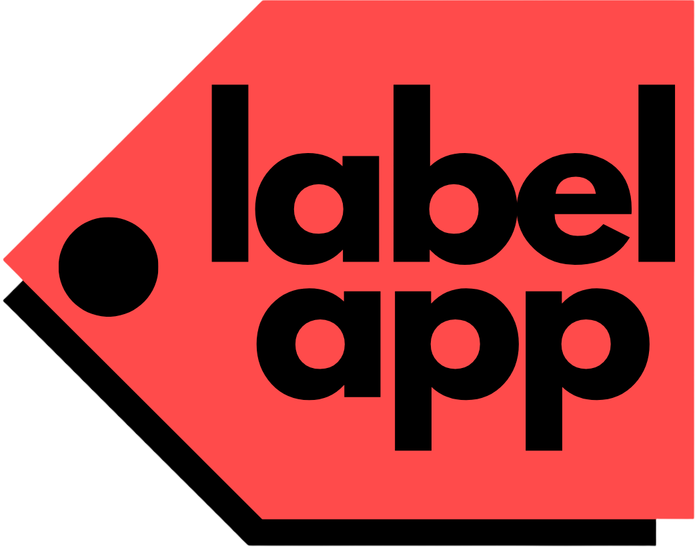

<p align="center">
    
</p>

# Label App
Label App is a free, simple application designed to assist in manually editing, visualizing and labelling your moderate-sized datasets.

The project is implemented in pure Python, using Streamlit framework with the special help of Pandas and Plotly libraries.

## Functionalities
You will be able to:
- Upload and preview your original dataset in any source extension of the supported: CSV, JSON, Excel and Parquet.
- Modify the dataset with several tools as you visualize the changes: handle NA values, rename and displace headers, add and delete variables, replace cell values, insert new samples, sort by columns, control variables data types and filter with conditional statements.
- Plot the dataset in a parameterized graph (line chart, scatter plot, bar chart) where you can draw by hand selectors to group samples and assign classes to them. The new label column can be added to the dataset and mantain the operational flow.
- Check aditional information about the dataset: general description, histograms for each variable, boxplots where detect outliers, bubble chart, radar chart, parallel coordinates plot, pie chart and correlation matrix.
- Rename and download the modified dataset in one of the supported extensions.

## Access
The app is reachable in the Streamlit Community Cloud -> https://label-app-javserjod.streamlit.app/

## Installation
If you are working on a Windows environment, directly download the compact package with all dependencies, located in Releases -> Label App.exe

Otherwise, you can guide yourself with these steps:
1. Download repository as ZIP or clone the repository with Git.
2. Open the IDE and navigate to the right directory.
3. Optional: create a virtual environment and activate it with the next commands:
```
Set-ExecutionPolicy -ExecutionPolicy RemoteSigned -Scope CurrentUser     # to avoid any problem (only if necessary)

pip install virtualenv    # install package

python -m venv venv   # create virtual environment (last argument is the name)

venv\Scripts\Activate.ps1   # activate it (venv is the name). Now prefix (venv) will appear on the CLI
```
4. Use PIP to install all the dependencies with the following command:
```
pip install -r requirements.txt     # download dependencies

pip list    # verify dependencies are downloaded
```
5. Run the app in http://localhost:8501/ with this command:
```
streamlit run application/main.py
```

## Author
Developed by Javier Serrano Jodral as final project for Biomedical Engineering Master's Degree at Universidad de Sevilla.

Download thesis report: [TFM_MIBSD_javserjod.pdf](https://github.com/user-attachments/files/20092234/TFM_MIBSD_javserjod.pdf)

